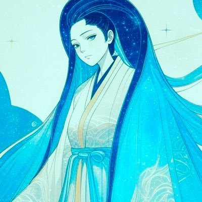
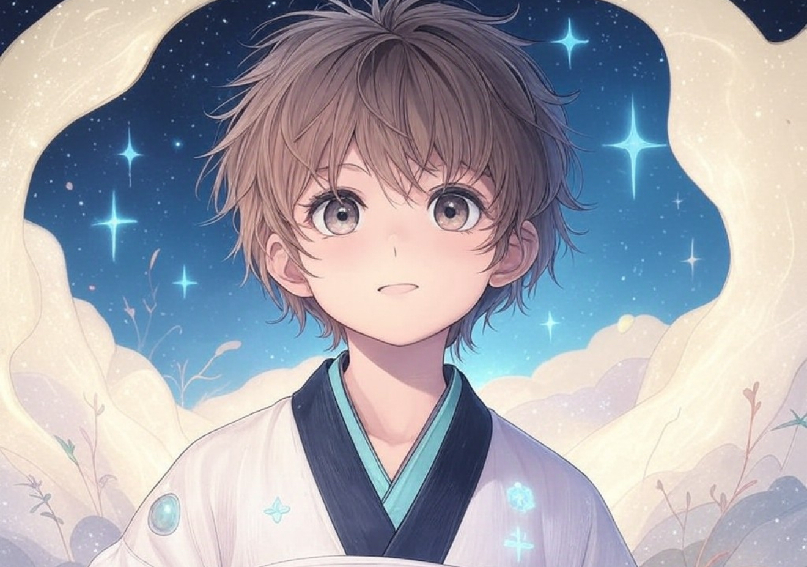
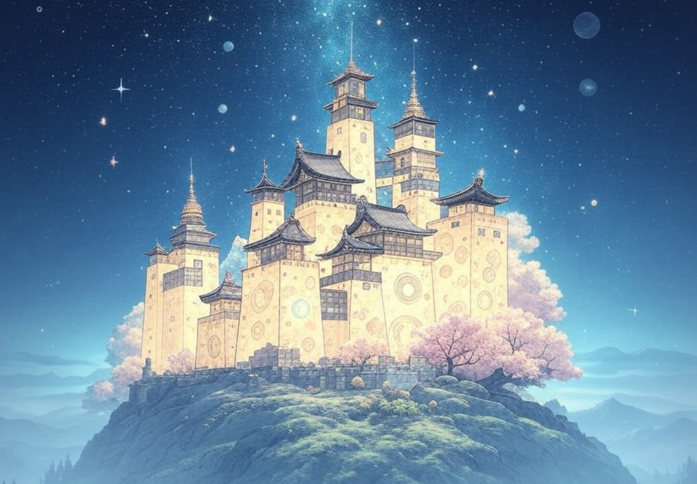
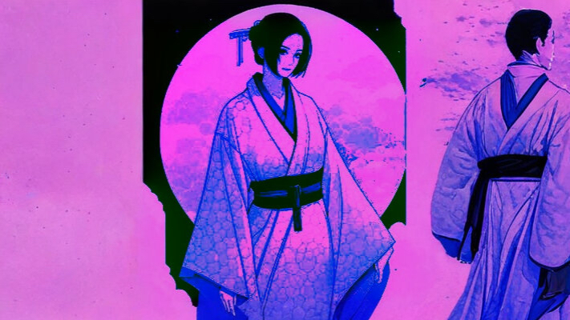
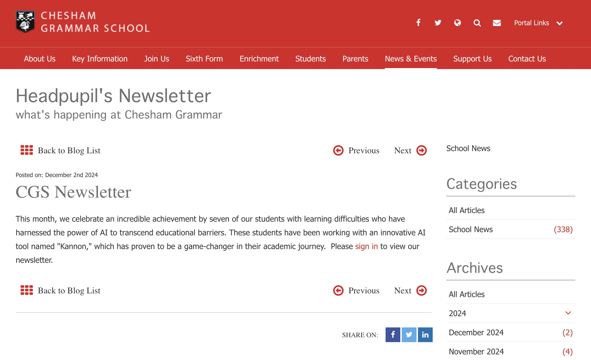

<h1 align="center">
   
  <b>kannon: storytelling engaging aesthetic</b> 
	
  <b>AI Powered Learning For All</b> 
</h1>

  📸 <a href="https://www.instagram.com/kannonsea/">[Instagram]</a> |
  𝕏 <a href="https://x.com/kannonsea">[X]</a> |
  🌊 <a href="https://x.com/dqwhunter">[Dev]</a>

Kannon is an AI-powered tool designed to transform ideas, concepts, and data into visually engaging stories, specifically tailored to support learners with difficulties. Inspired by Japanese aesthetics, it makes learning more accessible, intuitive, and enjoyable.

Kannon seamlessly integrates AI, art, and science.

## Example Outputs Of Kannon Aesthetics
Here are some sample visualizations generated by Kannon:

## Features

	•	Zen Flow Timeline: Chart progress with a tranquil, Zen-inspired design.
	•	Wave Link Mapping: Connect ideas through graceful, flowing wave patterns.
	•	Sumi-e Storyscapes: Craft immersive storyboards with the elegance of sumi-e art.

## Installation

1. Clone the repository:

git clone https://github.com/dqwhunter/kannon.git

## About Me  

Hi, I’m **Dennis Hunter** ([@dqwhunter](https://twitter.com/dqwhunter)). Growing up, I had learning difficulties and found it hard to concentrate or understand complex concepts—unless they were entertaining and visually engaging. That challenge shaped the way I think and create today.  

I built **Kannon** to bring that same sense of storytelling, aesthetics, and interactivity to others. My goal is to make learning, problem-solving, and creativity more accessible, enjoyable, and beautiful for everyone who uses it.

The vision is to help more students like the SEA Seven!

# Data Visualization: Storytelling

## **Section 1: Why Storytelling**

### Humans are wired for story
	•	Evoke and dissolve unease through crafted tension.
	•	Potent narratives engineer discord only to harmonize it.
	•	Stories ignite neural pathways, mimicking the sensory symphony of lived experience—sights, sounds, flavors, and motion entwined.

Fiction vs nonfiction (journalistic or documentary storytelling, or data storytelling)

	•	Such tales transcend disbelief, forging conviction in their wake.
	•	The craft of storytelling was a lifeline for early humanity.
	•	Its evolutionary mandate is unmistakable.
	•	Embrace the lens of the storyteller.

### Storytelling is essential

	•	Studies reveal humans devote 70–80% of their waking hours to the art of communication.
	•	Communication reigns supreme as the most sought-after skill.
	•	A story imprints itself on memory 22 times more deeply than raw facts alone — Jennifer Aaker.
	•	Mundane words (e.g., “chair”) stir only the linguistic centers of the brain.
	•	Sensory words (e.g., “coffee”) awaken neural pathways tied to taste, scent, and experience.
	•	The broader the brain’s activation, the more vivid, emotional, and resonant the story becomes.
	•	Statistics function like neutral words: informative, but inert.

Interweave data with narrative and awaken the senses. This synthesis ignites thought, emotion, and imagery, embedding the content deeply and irresistibly in the mind.

[Narrative Visualization: Telling Stories with Data](http://vis.stanford.edu/files/2010-Narrative-InfoVis.pdf)

### Use story even when you don't

	•	At its core, every tale demands a genesis, a journey, and a resolution.
	•	Yet, beneath this simplicity lies a deeper cadence: the trials of the protagonist and the crescendo where all tensions converge.

	•	The yellow highlight marks the story’s resolution, its final note.
	•	The headline serves as the tale’s opening chord.
	•	The body text unfolds the journey, the middle passage.
	•	The callout text strikes the story’s apex, the moment of peak tension.
	•	Headlines, callouts, and highlights are potent tools to inject the essential spark: anxiety.
